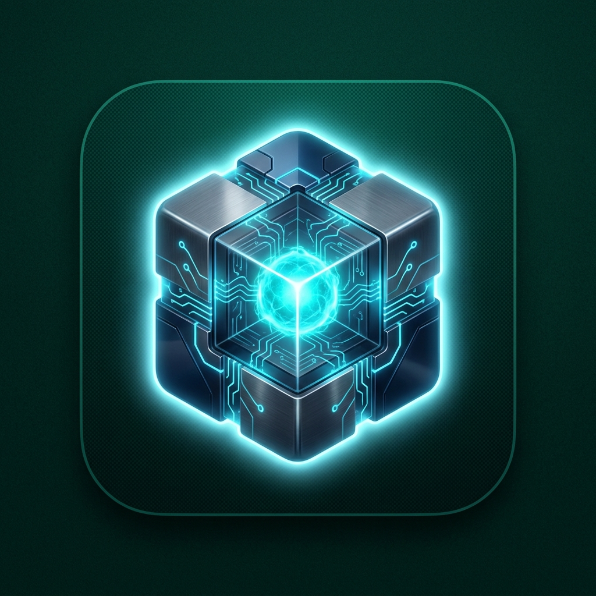

  

<h1 align="center">Curio</h1>

  <em>One interesting thing at a time.</em>

---

Curio is a knowledge discovery app — bite-sized facts, poetry, short stories, puzzles, and novels, all in one feed.

## Features

| Feature | Description |
|---------|-------------|
| **Feed** | Swipeable knowledge cards with 3D parallax, TTS, share, bookmark, shuffle |
| **Onboarding** | Pick interests from 21+ categories across Facts, Poems, Stories, Puzzles, Novels |
| **Discover** | Browse categories with emoji icons, L1 pills, and filters |
| **Puzzles** | Interactive Sudoku, Math, Logic, and Word puzzles with validation |
| **Novels** | 20 public-domain classics, offline download, chapter navigation, font customization |
| **Journal** | Private offline diary with prompts, mood tracking, rich text, calendar, streak tracking |
| **Bookmarks** | Locally-saved favorites, persist across sessions |
| **Profile** | Personalization, dark mode toggle, privacy controls |
| **TTS** | Chunked streaming with gapless ExoPlayer, speed control (1×–2×), sentence-level highlighting |
| **Annotations** | Long-press any word in a novel to save it with a personal note (local-only) |

## Content

**21+ categories** across 5 sections:
- **Facts** — Science, Space, History, Biology, Psychology, Philosophy, Physics, Startups, AI, Economics, Nature, Technology, Movies, Neuroscience, Geography, Music, Sports, Food, Literature
- **Poems** — English Poems, Shayari, Hindi Poems, Classics, Modern
- **Short Stories** — Classic Fiction, Micro Stories, Serialized Stories
- **Puzzles** — Sudoku, Math, Logic, Word, Mixed
- **Novels** — 20 classic titles (Pride & Prejudice, Moby Dick, Dracula, etc.) with 804 chapters

Content is scraped daily from Wikipedia, PoetryDB, Science Daily, Smithsonian, Project Gutenberg, and more.

## Design

Dark-first with an emerald/cyan/gold palette. Dynamic gradients, glassmorphism, and 3D parallax cards. Warm sepia light mode for novel reading.

## Screenshots

  

> Screenshots coming soon.
